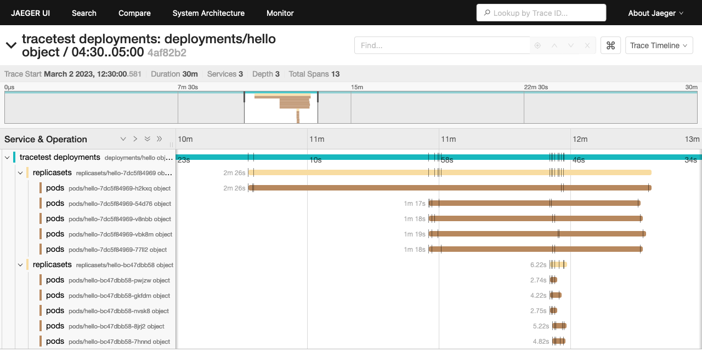

# Quick start

Kelemetry requires setting up the audit webhook for kube-apiserver.
To try out Kelemetry, the easiest way is to create a new test cluster
using the pre-made kind config we prepared for Kelemetry setup.

1. Ensure the prerequisites are available:
  - [kind](https://kind.sigs.k8s.io)
  - [docker-compose](https://docs.docker.com/compose/install/)

2. Run the quickstart scripts:

```console
$ make kind quickstart
```

3. Open <http://localhost:16686> in your browser to view the trace output with Jaeger UI.

4. Check out what happens when you deploy!

```console
$ kubectl --context kind-tracetest create deployment hello --image=alpine:latest -- sleep infinity
deployment.apps/hello created

$ kubectl --context kind-tracetest scale deployment hello --replicas=5
deployment.apps/hello scaled

$ kubectl --context kind-tracetest set image deployments hello alpine=alpine:edge
deployment.apps/hello image updated
```

Search `resource=deployments name=hello` in Jaeger UI:


